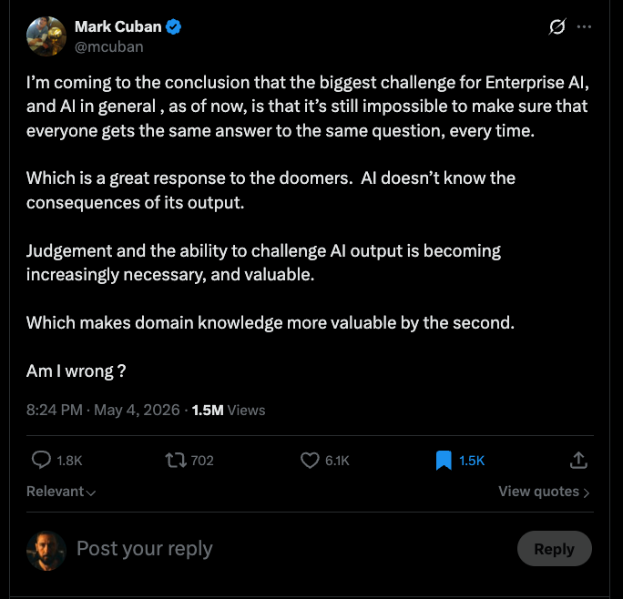

<div align="center">

# ALS — Agent Language Specification

**Build a personal agent system that subtracts your attention.**

A model harness engineering SDK — built for Claude.

**Beta Research Preview**

ALS is public for early adopters who are comfortable with breakage, manual rewrites, and rapid iteration. Read the preview contract in [RESEARCH-PREVIEW.md](RESEARCH-PREVIEW.md).

Install from the stable marketplace, update with `/update`, and expect fix-forward recovery while preview-era lifecycle tooling is still incomplete.

</div>

---

## The Premise

A personal agent system is not about adding agents. It is about subtracting your attention.

Every step you do manually is a loop running in your head — receive input, decide, act, repeat. ALS lets you encode those loops as files and skills that an agent runs in your place. You graduate from doing the work, to watching the loop do the work, to letting it run while you go up a layer.

```
   Before                              After

   ┌─────────────┐                    ┌─────────────┐
   │    HUMAN    │                    │    HUMAN    │   ← you, up a layer
   │  does work  │                    │ sets intent │
   └─────────────┘                    └─────────────┘
                                             │
                                             ▼
                                      ┌─────────────┐
                                      │    LOOP     │   ← orchestrates
                                      └─────────────┘
                                             │
                                             ▼
                                      ┌─────────────┐
                                      │    LOOP     │   ← does work
                                      └─────────────┘
                                             │
                                             ▼
                                          [output]
```

The unit is the loop:

```
   ┌──────────────────────────────────────────────────┐
   │     loop   =   ( prompt )   +   ( agent runner ) │
   └──────────────────────────────────────────────────┘
```

The prompt declares the work. The runner can be anything that runs the prompt — a Claude Code session, a headless dispatcher, a scheduled cron. Swap the runner; the loop still runs.

The hard part is making those loops trustworthy enough to leave alone. LLMs are non-deterministic; the files they produce do not have to be, and the lifecycle they move through does not have to be either. ALS is the language for *that* — the contract that lets you ascend.

## The Schema Is the Truth

<div align="center">

<br/>
<sub><i>Agreed. Judgement, challenge, and domain knowledge — encoded into every write.</i></sub>
</div>

ALS pushes determinism to the boundaries the model writes against — at every layer where work happens.

### At the file layer

Every record is validated against its `module.ts` shape: frontmatter fields, types, nullability, refs, and the body sections each record must contain. A Stop hook runs the gate after every Write or Edit. If the file is dirty, the agent gets a structured diagnostic and rewrites. It cannot claim done until the gate is green.

```
   ┌─────────┐    ┌──────┐    ┌────────────────┐    ┌─────────┐
   │  Write  │───▶│ hook │───▶│  schema check  │───▶│ ✓ pass  │
   └─────────┘    └──────┘    └────────────────┘    └─────────┘
        ▲                              │
        │                              │ ✗  + diagnostic
        │                              ▼
        └──────── agent rewrites ──────┘
```

You do not verify the output. The gate does.

### At the loop layer

A `delamain` is the same kind of contract — but for the *motion* of an item through its lifecycle. States are declared with `actor: operator | agent`. Transitions are declared with `class: advance | rework | exit`. The compiler enforces graph invariants: reachability from the initial state, terminal states only at the end, no self-loops, no orphans, every non-terminal state with a path to terminal.

```
   ┌─────────┐   ┌──────────┐   ┌─────────┐   ┌─────────┐   ┌─────────┐
   │  draft  │──▶│ planning │──▶│   dev   │──▶│ review  │──▶│ merged  │
   │ (oper.) │   │ (agent)  │   │ (agent) │   │ (oper.) │   │ (term.) │
   └─────────┘   └──────────┘   └─────────┘   └─────────┘   └─────────┘
```

The loop runs on rails the same way the file does. Items cannot drift into illegal states. Agents cannot choose transitions that do not exist.

### Graduation is a schema edit

This is what makes the layering composable. Promoting a step from human-in-the-loop to autonomous is a single declaration change:

```yaml
states:
  - name: planning
    actor: operator   # before — operator owns this step
    # actor: agent    # after  — graduated, agent owns this step
    path: planning.md
```

The boundary between operator attention and agent execution is encoded, not improvised. The same compiler that validates files validates the path the work takes through them.

## What's Inside

ALS is a filesystem-backed specification language with a compiler and a small set of agent skills.

```
   ┌──────────────────────────────────────────────────────────┐
   │                       cyber-brain                        │  ← orchestrates what
   │                (operator's attention layer)              │    the operator sees
   └──────────────────────────────────────────────────────────┘
   ┌──────────────────────────┐  ┌────────────────────────────┐
   │          skills          │  │      delamain bundles      │  ← process surface  +
   │    (process surface)     │  │   (autonomous pipelines)   │    autonomous loops
   └──────────────────────────┘  └────────────────────────────┘
   ┌──────────────────────────────────────────────────────────┐
   │                        module.ts                         │  ← what valid records
   │                    (record shapes)                       │    look like
   └──────────────────────────────────────────────────────────┘
   ┌──────────────────────────────────────────────────────────┐
   │                         compiler                         │  ← validates module
   │                                                          │    shapes, records,
   │                                                          │    refs, body, graphs
   └──────────────────────────────────────────────────────────┘
```

A strict contract: structure separates from workflow, operator attention separates from agent execution, across every device the operator touches.

ALS targets agent harnesses through explicit projections. Claude Code and Codex CLI are the current implemented surfaces; Cowork, Desktop, Web, wearables, and ambient surfaces remain design targets unless the implementation matrix says otherwise.

## What Works Today

The current public preview is centered on two usable surfaces:

- `alsc validate` validates an ALS system and emits machine-readable JSON
- `alsc deploy <harness>` projects active ALS assets into the selected harness roots
- `alsc changelog inspect` validates the ALS repo's structured `CHANGELOG.md` staging area
- `reference-system/` provides the canonical reference fixture for the current ALS v1 contract

## Install

ALS is distributed as a Claude Code plugin and now includes Codex plugin metadata for local Codex workflows. Requires [Bun](https://bun.sh) >= 1.3.0 and [jq](https://jqlang.github.io/jq/).

ALS uses a **two-channel release model**:

- **Stable channel** (`als-marketplace-stable`) — recommended for everyone. Source: [`nfrith/als-stable`](https://github.com/nfrith/als-stable). Receives versions only after RC validation passes.
- **RC channel** (`als-marketplace`) — for the maintainer's pre-release testing only. Source: this repo. Versions land here first to be validated before advancing to stable.

### Option A: From the terminal (stable channel — recommended)

```bash
claude plugin marketplace add https://github.com/nfrith/als-stable
claude plugin install als@als-marketplace-stable
```

### Option B: From inside Claude Code Desktop (stable channel — recommended)

1. Open Customize → Plugins → Add plugin → Add marketplace
2. Enter `https://github.com/nfrith/als-stable` as the marketplace source
3. From the Plugins Directory, find **ALS** and click **Install**
4. Type `/install` to bootstrap your first ALS system

### Option C: RC channel (maintainer / contributor only)

```bash
claude plugin marketplace add https://github.com/nfrith/als
claude plugin install als@als-marketplace
```

Use only if you need the latest unreleased commits. Edgerunners should NOT use this channel — bumps land here first and may still need hotfixes before stable advances.

Once installed, ALS skills (`/install`, `/new`, `/validate`, `/change`, `/migrate`, `/update`) are available inside Claude Code sessions.

### Codex marketplace install

This repo includes Codex plugin metadata for preview workflows. Codex plugin hooks require the Codex hooks feature flag:

```toml
[features]
codex_hooks = true
```

Add the marketplace, restart Codex, then install **ALS** from `/plugins` under **ALS Local Marketplace**:

```bash
codex plugin marketplace add https://github.com/JC-Flanders/als.git
```

Codex skills are invoked as `$install`, `$new`, `$validate`, `$change`, `$migrate`, and `$update`. The Codex projection path is:

```bash
bun alsc/compiler/src/cli.ts deploy codex <system-root>
```

## Update

ALS does not auto-update installed systems in the background. When a newer preview release is available, run `/update` from inside Claude Code.

If a preview release is bad, the recovery path is fix-forward: ship a hotfix bump, then run `/update` again. ALS does not promise rollback or automatic reverse migration during preview.

## How to Use

The ALS plugin adds skills to the active harness — slash commands in Claude Code and `$skill` prompts in Codex — that guide the agent through structured workflows.

### `/install` — Bootstrap a new ALS system

Start here in a fresh project. ALS welcomes you, checks prerequisites, acknowledges the ALS platform code, interviews for the first module, bootstraps `.als/`, validates the authored system, and deploys the active harness assets.

```
/install Track client projects with status, owner, and deliverables
```

### `/new` — Add another module

Once the project is already ALS-aware, use `/new` to add the next module. It reuses the same domain-modeling interview and authors another module bundle inside the existing system.

```
/new I also need a people directory for client contacts and owners
```

### `/validate` — Check your system

Runs the compiler against your ALS system and reports errors.

```
/validate
# Validate a specific module:
/validate backlog
```

### `/change` and `/migrate` — Evolve your schema

When you need to add a field, rename a section, modify the shape, or update a skill definition, the process is two steps: prepare, then execute.

**`/change`** prepares the next version bundle. It interviews you about the change, authors `vN+1`, and stages the migration assets — without touching live data.

```
/change backlog add a priority field
```

**`/migrate`** takes the prepared bundle and executes it. It validates the staged version, dry-runs on a disposable clone, and performs the live cutover atomically.

```
/migrate backlog
```

## How It Works

An ALS system is a directory with a `.als/` metadata tree and module data alongside it. Modules can mount at any path — top-level or nested.

```
my-system/
├── .als/
│   ├── system.ts                      # system identity and module registry
│   └── modules/
│       ├── backlog/
│       │   └── v1/
│       │       ├── module.ts          # schema: fields, sections, body contract
│       │       └── skills/
│       │           ├── backlog-create/
│       │           │   └── SKILL.md   # skill: how to create records
│       │           └── backlog-get/
│       │               └── SKILL.md   # skill: how to read records
│       └── people/
│           └── v1/
│               ├── module.ts
│               └── skills/
│                   └── people-module/
│                       └── SKILL.md
│
├── backlog/                           # module mounted at root level
│   └── items/
│       ├── ITEM-001.md                # record: typed frontmatter + governed prose
│       └── ITEM-002.md
│
└── workspace/
    └── people/                        # module mounted under workspace/
        └── PPL-001.md
```

**`module.ts`** defines what valid records look like — fields, types, nullability, enums, refs, and the exact body sections each record must contain. Variant entities can also use a discriminator to select additional frontmatter fields and a variant-specific body contract.

**`SKILL.md`** defines how agents interact with the data — the procedures, scope boundaries, and domain vocabulary for each operation.

**Records** are markdown files with YAML frontmatter. The compiler validates them against the shape. Skills provide the interface for creating and modifying them.

## Why ALS

- **Attention is the scarce resource.** ALS is built around managing operator attention, not maximizing agent throughput. Every primitive — modules, skills, delamains, the cyber-brain — exists to help you graduate work upward and out of your head.
- **Single session.** You only ever need one supported harness session open. ALS systems run inside the session you already have.
- **Online-ready.** Harness projections keep ALS out of local-only lock-in; Claude Code online and cowork remain design targets as their primitives mature.
- **Future-proof.** ALS builds on native harness surfaces — skills, tools, markdown, and projected runtime files — so new agent products can get explicit projections instead of ad hoc glue.
- **No third-party services.** You do not need to host, maintain, or pay for external agent infrastructure.
- **Host-harness security.** ALS stays inside the security boundary of the harness you already chose instead of requiring a separate third-party agent service.
- **Event-driven, token-efficient.** Agents run when work exists, not on a polling loop. No heartbeat, no daemon burning tokens in the background. The heartbeat is the operator. Always.
- **Agents run inside the session.** Dispatched agents are background shell tasks inside your active harness session. No separate process manager, no orphaned daemon layer.
- **Runtime sessions — same guarantees.** Dispatched work inherits the active harness/provider runtime guarantees instead of introducing another control plane.
- **Operator and agent are first-class citizens.** The language distinguishes operator-owned and agent-owned states. Both are formalized, not bolted on.

## Philosophy

ALS applies the same two-layer architecture that classical software uses — but built on markdown files and agent skills instead of code and databases.

```
CLASSICAL SOFTWARE                              ALS

┌───────────────────────┐           ┌───────────────────────┐
│   App / Business Logic│           │        Skills          │
└───────────────────────┘           └───────────────────────┘

┌───────────────────────┐           ┌───────────────────────┐
│       Database        │           │      Filesystem        │
│                       │           │                        │
│  ┌─────────────────┐  │           │  ┌──────────────────┐  │
│  │     Schema      │  │           │  │     module.ts    │  │
│  └─────────────────┘  │           │  └──────────────────┘  │
│                       │           │                        │
│  ┌────────┐┌────────┐ │           │  ┌────────┐┌────────┐  │
│  │ users  ││ orders │ │           │  │backlog ││ exper~ │  │
│  │--------││--------│ │           │  │--------││--------│  │
│  │ id     ││ id     │ │           │  │ items/ ││ prog~/ │  │
│  │ name   ││ user_id│ │           │  │ ├ 001  ││ ├ PRG/ │  │
│  │ email  ││ amount │ │           │  │ └ 002  ││ │ └run/│  │
│  │        ││ status │ │           │  │        ││ └ PRG/ │  │
│  └────────┘└────────┘ │           │  └────────┘└────────┘  │
│                       │           │                        │
└───────────────────────┘           └───────────────────────┘

              Same architecture. Different primitives.
```

**Databases** have schemas that define what valid data looks like. Tables hold rows. Foreign keys encode relationships.

**ALS** has shapes that define what valid data looks like. Directories hold markdown records. Filesystem paths encode relationships.

The compiler validates everything. Skills provide the interface.

### Migrations

ALS codifies schema migrations the same way classical software does — prepare, test, execute, flip.

```
CLASSICAL SOFTWARE

  v1                          Migration                        v2
┌──────────┐                                               ┌──────────┐
│ App Logic│───────────── Update code ────────────────────▶│ App Logic│
└──────────┘                                               └──────────┘
┌──────────┐    Write DDL ──▶ Test on staging ──▶ Run on   ┌──────────┐
│ Database │─────────────────────────────────────production▶│ Database │
│  Schema  │                                               │  Schema  │
│  Tables  │                                               │  Tables  │
└──────────┘                                               └──────────┘


ALS

  v1                          Migration                        v2
┌──────────┐                                               ┌──────────┐
│  Skills  │───────────── Update skills ──────────────────▶│  Skills  │
└──────────┘                                               └──────────┘
┌──────────┐    Update shape ▶ Dry-run on clone ▶ Run on   ┌──────────┐
│Filesystem│─────────────────────────────────────  live   ─▶│Filesystem│
│module.ts │                                               │module.ts │
│ Records  │                                               │ Records  │
└──────────┘                                               └──────────┘
```

`change` prepares the next version bundle. `migrate` tests it on a disposable clone, then executes the live cutover. Every migration is versioned, manifested, and auditable.

## Preview Contract

This is a research preview, not a stability release.

- Authored-source compatibility is not guaranteed across preview releases.
- Upgrading may require manual rewrites.
- Users should pin exact preview versions.
- ALS currently supports `als_version: 1` only.
- ALS does not yet ship a language-version upgrade toolchain.
- ALS does not yet ship a real warning or deprecation lifecycle.
- Harness projections are preview surfaces; Claude has the broader operator UI surface today.

### Harness Parity

| Surface | Claude | Codex | Notes |
|---------|--------|-------|-------|
| Deploy | yes | yes | `alsc deploy <harness>` |
| Validate hooks | yes | yes | Codex uses hook payload adapters |
| SessionStart operator profile | yes | yes | Codex adapter exists |
| Stop validation | yes | yes | Codex adapter exists |
| SessionEnd dispatcher cleanup | yes | no | Codex has no equivalent lifecycle hook in this plugin |
| Update transaction follow-through | yes | yes | `$update` uses `--harness codex` after local plugin source refresh |
| Plugin self-update | yes | no | Claude marketplace only |
| Dispatcher boot/reboot | yes | yes | Uses `DELAMAINS_ROOT` and `ALS_PLUGIN_ROOT` from runtime env |
| Statusline | yes | no | Claude-specific settings/statusline surface |
| Dashboard | yes | limited | Current dashboard lifecycle remains Claude-oriented |

The longer-form preview contract lives in [RESEARCH-PREVIEW.md](RESEARCH-PREVIEW.md). Public docs intentionally stay compact: install from the stable marketplace, update with `/update`, and expect fix-forward recovery rather than rollback.

## Repository Structure

```text
alsc/
  compiler/       # Validator and harness asset projector
  skills/         # ALS skill definitions and workflow material
sdr/              # Spec Decision Records
reference-system/ # Canonical reference fixture
```

## Watch It Being Built

ALS isn't ready yet — but you can watch the factory floor live. We stream the building of ALS on YouTube: [youtube.com/@0xnfrith](https://youtube.com/@0xnfrith)

Come hang out while it's being made.

## Feedback

Use GitHub issues for:

- compiler bugs
- authored-system breakage reports
- research feedback on what ALS should optimize for next

See [CONTRIBUTING.md](CONTRIBUTING.md) for the expected issue detail.

---

<div align="center">

> *Wherever you sit, the loop can sit there too. Then you go up a layer.*

</div>

---

## License

Copyright 2026 Section 9 Technologies LLC. Licensed under [Elastic License 2.0 (ELv2)](LICENSE).
